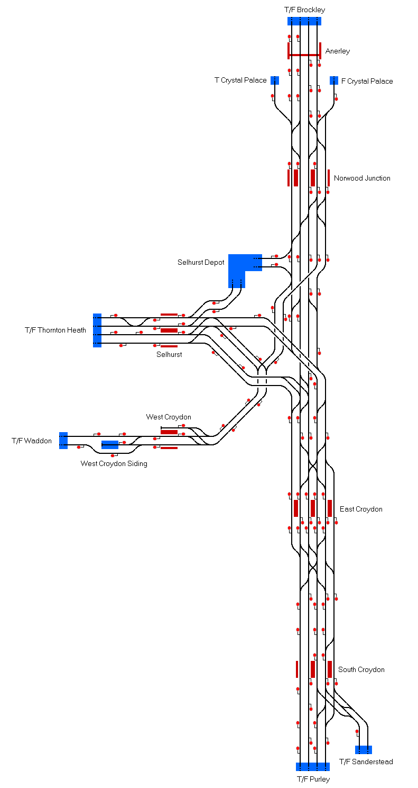

# Croydon 
Railways in South London in and around Croydon.

## Current Status

| Stage         | Status        |
| ------------- |:-------------:|
| Track Plan     | :heavy_check_mark: |
| Signalling      | :heavy_check_mark:      |
| Naming | :x:      |
| Speed Limits | :x: |
| Distances | :x: |
| Timetable | :x: |
| Documentation | :x: |

## Data Sources

- [OpenStreetMap](https://www.openstreetmap.org/#map=15/51.3880/-0.0887)
- [Thameslink Driver's Eye View: Brighton to Bedford (Ben Elias via YouTube)](https://youtu.be/-KCNlPvxomM)
- [London Bridge to Brighton driver's eye view (Ben Elias via YouTube)](https://www.youtube.com/watch?v=sE04Faxfo7I)
